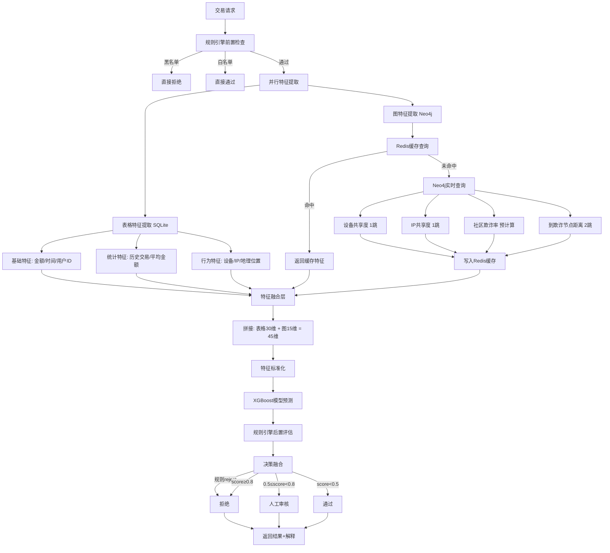

# 零售金融反欺诈框架

## 业务场景
- **目标业务**: 信用卡申请反欺诈
- **日均请求量**: 10,000 笔
- **响应时间要求**: 
  - 快速模块: < 100ms (P99)
  - LLM 模块: < 3s (P99)

## 核心功能模块

### 1. 快速反欺诈模块 (毫秒级响应)
**目标**: 使用机器学习、图网络和规则引擎对客户属性进行快速打分
- **技术栈**: XGBoost/LightGBM + Neo4j 图网络 + YAML 规则引擎
- **输入**: 申请人基础信息、行为数据、设备指纹、IP 信息
- **输出**: 
  - 风险分数: 0-1000
  - 决策: ACCEPT (0-300) / REVIEW (300-700) / REJECT (700-1000)
  - 命中规则列表
  - 可解释性说明（触发规则、图特征异常项、模型重要特征）

#### 1.1 检测流程架构



#### 1.2 特征维度设计 (45维)

**表格特征 (30维)** - 来源: SQLite 数据库
- 基础特征 (5维): `amount`, `time_of_day`, `day_of_week`, `user_id_hash`, `merchant_category`
- 统计特征 (10维): 
  - 用户历史: `transaction_count_24h`, `transaction_count_7d`, `avg_amount_30d`
  - 设备/IP: `device_transaction_count_1h`, `ip_transaction_count_1h`
  - 商户: `merchant_fraud_rate`, `merchant_avg_amount`
- 行为特征 (8维): `time_since_last_transaction`, `amount_deviation_from_avg`, `is_new_device`, `is_new_ip`
- 交叉特征 (7维): `amount_to_avg_ratio`, `hour_risk_score`, `location_change_speed`

**图特征 (15维)** - 来源: Neo4j 图数据库
- 节点特征 (5维):
  - `user_fraud_neighbor_count`: 关联欺诈用户数量
  - `user_community_fraud_rate`: 用户所在社区欺诈率 (预计算)
  - `user_degree_centrality`: 用户度中心性
  - `user_pagerank_score`: PageRank 分数 (预计算)
  - `distance_to_nearest_fraud`: 到最近欺诈节点的距离 (最多2跳)

- 关系特征 (7维):
  - `device_share_count`: 共享设备的用户数
  - `device_fraud_share_rate`: 共享设备的欺诈用户占比
  - `ip_share_count`: 共享IP的用户数
  - `ip_fraud_share_rate`: 共享IP的欺诈用户占比
  - `address_share_count`: 共享地址的用户数
  - `max_relationship_strength`: 最强关联关系权重
  - `fraud_cluster_coefficient`: 欺诈聚集系数

- 子图特征 (3维):
  - `local_clustering_coefficient`: 局部聚集系数
  - `neighbor_fraud_rate`: 1跳邻居欺诈率
  - `is_in_fraud_community`: 是否在已知欺诈社区 (0/1)

#### 1.2A 当前实现的 45 维特征列表 (与代码对齐)

> 本小节描述的特征列表直接对应代码中的 `feature_service.get_feature_names()` 和 `GraphFeatureService.get_feature_names()`，是当前版本实际落地的 45 维特征。

- **表格特征 30 维** (由 `feature_service.extract_features` 生成)
  - **基础金额与派生 (5维)**: `amount`, `amount_log`, `amount_sqrt`, `amount_square`, `amount_percentile`
  - **用户历史 (近30天, 5维)**: `user_transaction_count_30d`, `user_avg_amount_30d`, `user_std_amount_30d`, `user_max_amount_30d`, `amount_vs_avg_ratio`
  - **短期活跃度 (2维)**: `user_transaction_count_7d`, `user_transaction_count_1h`
  - **时间特征 (4维)**: `hour`, `day_of_week`, `is_weekend`, `is_night`
  - **设备/IP 特征 (2维)**: `device_transaction_count`, `ip_transaction_count`
  - **扩展预留特征 (12维)**: `extended_feature_1` ~ `extended_feature_12` (当前为 0，占位用于后续新增业务特征)

- **图特征 15 维** (由 `GraphFeatureService.extract_graph_features` 生成)
  - `fraud_neighbor_count`, `community_fraud_rate`, `degree_centrality`, `pagerank_score`, `distance_to_fraud`
  - `device_share_count`, `device_fraud_rate`, `ip_share_count`, `ip_fraud_rate`, `address_share_count`
  - `max_relationship_strength`, `fraud_cluster_coefficient`, `local_clustering_coefficient`, `neighbor_fraud_rate`, `is_in_fraud_community`


#### 1.3 图特征提取策略

**策略1: 三级缓存机制** (优先级从高到低)
```python
# L1 缓存: Redis 用户最近特征 (TTL: 5分钟)
redis_key = f"graph_features:user:{user_id}"
if cached := redis.get(redis_key):
    return cached

# L2 缓存: Redis 设备/IP共享度 (TTL: 30分钟)
redis_key = f"graph_features:device:{device_id}"

# L3 缓存: Neo4j 预计算特征 (每小时更新)
# 直接从节点属性读取: community_fraud_rate, pagerank_score
```

**策略2: 限制查询深度** (控制延迟)
```cypher
-- 1跳查询: 设备共享度 (~5-10ms)
MATCH (u:User {user_id: $user_id})-[:USES_DEVICE]->(d:Device)<-[:USES_DEVICE]-(other:User)
RETURN count(distinct other) as device_share_count,
       sum(CASE WHEN other.is_fraud THEN 1 ELSE 0 END) as fraud_count

-- 2跳查询: 到欺诈节点距离 (~10-20ms)
MATCH path = shortestPath(
    (u:User {user_id: $user_id})-[*..2]-(fraud:User {is_fraud: true})
)
RETURN length(path) as distance
ORDER BY distance LIMIT 1
```

**策略3: 异步更新图数据** (不阻塞检测)
```python
# 检测完成后，异步发送消息到 Kafka
kafka.send('graph_update', {
    'user_id': user_id,
    'device_id': device_id,
    'ip_address': ip_address,
    'is_fraud': is_fraud
})

# 后台 Worker 消费消息，批量更新 Neo4j
# 每分钟批量写入，避免频繁单次写入
```

#### 1.4 响应时间分解 (P99 < 100ms)

| 步骤 | 耗时 (ms) | 优化手段 |
|------|-----------|----------|
| 规则引擎前置检查 | 2-5 | YAML规则内存加载，快速匹配 |
| 表格特征提取 (SQLite) | 5-10 | 索引优化，连接池复用 |
| 图特征提取 (Neo4j/Redis) | 15-30 | **Redis L1缓存命中率 >70%**<br>Neo4j查询限制2跳<br>只读副本分流 |
| 特征融合与标准化 | 1-2 | NumPy向量化操作 |
| XGBoost 模型推理 | 10-20 | 模型量化 (ONNX)<br>树深度限制 (max_depth=6) |
| 规则引擎后置评估 | 3-8 | 规则优先级排序，短路逻辑 |
| 结果封装与返回 | 2-5 | Pydantic 序列化 |
| **总计 (典型)** | **40-80ms** | **缓存命中时 <50ms** |
| **最坏情况 (缓存未命中)** | **60-120ms** | **仍满足 P99 <100ms** |

**关键优化点**:
1. **Redis 缓存命中率**: 通过5分钟 TTL 和热点特征预加载，实现 >70% 命中率
2. **Neo4j 查询优化**: 
   - 创建必要索引: `CREATE INDEX ON :User(user_id)`
   - 限制查询深度: 最多2跳，避免图遍历爆炸
   - 读写分离: 查询走只读副本，写入走主节点
3. **并行执行**: 表格特征和图特征提取并行进行
4. **特征预计算**: 复杂特征 (PageRank, 社区检测) 离线计算，在线直接读取

#### 1.5 特征融合与模型预测

> 当前线上 XGBoost 模型已经基于上述 45 维特征重新训练, 模型输入维度与 `feature_service.get_feature_names()` 的顺序完全一致, 保证线上推理与特征工程严格对齐。

```python
# 伪代码示例
async def fast_detect(request):
    # 1. 规则前置检查 (2-5ms)
    rule_result = rule_engine.pre_check(request)
    if rule_result.decision == 'reject':
        return reject_response(rule_result.reasons)
    
    # 2. 并行特征提取 (20-40ms)
    table_features, graph_features = await asyncio.gather(
        extract_table_features(request, db),     # SQLite
        extract_graph_features(request, neo4j)   # Neo4j + Redis
    )
    
    # 3. 特征融合 (1-2ms)
    combined_features = np.concatenate([
        table_features,   # 30维
        graph_features    # 15维
    ])  # 总计 45维
    
    # 4. 标准化 (1ms)
    normalized = scaler.transform(combined_features.reshape(1, -1))
    
    # 5. XGBoost 预测 (10-20ms)
    fraud_score = xgboost_model.predict_proba(normalized)[0][1]
    
    # 6. 规则后置评估 (3-8ms)
    rule_score = rule_engine.post_evaluate(request, fraud_score)
    
    # 7. 决策融合 (1ms)
    final_score = max(fraud_score, rule_score)
    decision = make_decision(final_score, rule_result)
    
    return FraudDetectionResponse(
        fraud_score=final_score,
        decision=decision,
        triggered_rules=rule_result.triggered_rules,
        graph_features_used=graph_features,
        execution_time_ms=total_time
    )
```

#### 1.6 可解释性输出

每次检测返回详细的解释信息:
- **规则解释**: 触发了哪些规则 (如 "超大额交易", "设备黑名单")
- **图特征异常**: 哪些图特征超过阈值 (如 "设备共享度过高: 8个用户")
- **模型特征重要性**: 对本次预测贡献最大的Top 5特征
- **风险因素列表**: 综合规则和模型给出的风险点

示例输出:
```json
{
  "fraud_score": 0.85,
  "risk_level": "high",
  "decision": "reject",
  "triggered_rules": [
    {"rule_name": "超大额交易", "weight": 0.8},
    {"rule_name": "设备共享异常", "weight": 0.65}
  ],
  "graph_features_anomaly": [
    "设备共享度过高: 8个用户共享同一设备",
    "用户社区欺诈率: 35% (高风险社区)"
  ],
  "top_features": [
    {"feature": "device_fraud_share_rate", "importance": 0.23},
    {"feature": "amount", "importance": 0.18},
    {"feature": "community_fraud_rate", "importance": 0.15}
  ],
  "execution_time_ms": 68
}
```

### 2. LLM+Agent 智能反欺诈模块 (秒级响应)
**目标**: 对快速模块打分中间值 (300-700) 进行深度分析和二次判断, 提供可解释的决策建议
- **技术栈**: Kimi 2 + LangGraph + Qdrant 向量数据库
- **角色**: 多 Agent 协同 (行为分析 / 图关系分析 / 规则与合规 / 裁决与解释)

#### 2.1 触发策略与总体流程

> LLM 模块只处理最“纠结”的 5-10% 样本, 通过多 Agent 深度分析, 平衡召回率、误报率与人工审核成本。

- **触发条件示例**:
  - 快速模块 `fraud_score` 落在灰区: 例如 0.3 ≤ score < 0.7
  - 或规则引擎出现“高风险规则命中 + 低风险规则命中”的冲突情况
  - 或业务自定义标签: 某些特定商户/渠道的交易强制进入 LLM 复核
- **整体流程**:
  1. Fast 模块完成初判, 输出 `fraud_score`、`risk_level`、命中规则、45 维特征
  2. 满足触发条件时, 构造一份结构化+自然语言的上下文发送给 LLM+Agent
  3. 多个 Agent 分维度给出意见 (行为/图关系/规则), 最终裁决 Agent 汇总
  4. 生成结构化 JSON 结果 + 人类可读解释, 写回 `FraudDetectionResponse.llm_analysis/llm_reasoning`

#### 2.2 Agent 角色设计 (基于 LangGraph)

- **行为模式分析 Agent (BehaviorAgent)**
  - 输入: 用户历史金额分布、频率、时间模式 + fast 模块行为特征摘要
  - 关注:
    - 本次金额是否显著偏离历史均值/最大值
    - 是否存在短时高频、多次尝试、金额递增等典型欺诈模式
  - 输出 (JSON):
    - `behavior_risk_level`: `"high" | "medium" | "low"`
    - `behavior_reasons`: 1-3 条简要理由

- **图关系风险 Agent (GraphAgent)**
  - 输入: 图特征摘要 (设备/IP/地址共享度、社区欺诈率、到欺诈节点距离等)
  - 关注:
    - 是否处在高风险社区 (community_fraud_rate 较高)
    - 设备/IP 是否与多个已确认为欺诈的账号强关联
  - 输出 (JSON):
    - `graph_risk_level`: `"high" | "medium" | "low"`
    - `graph_reasons`: 关键图风险证据列表

- **规则与合规 Agent (RuleAgent)**
  - 输入: 命中规则列表、权重、规则类型 (金额/频率/设备/地域等)
  - 关注:
    - 哪些规则强烈支持拒绝/通过
    - 从合规视角是否需要强制人工审核
  - 输出 (JSON):
    - `rule_risk_level`: `"high" | "medium" | "low"`
    - `rule_reasons`: 规则视角的主要理由

- **裁决与解释 Agent (JudgeAgent)**
  - 输入: fast 模块输出 + 上述三个 Agent 的 JSON 结果
  - 任务:
    - 综合各维度风险, 生成最终 `llm_decision`: `"accept" | "review" | "reject"`
    - 给出 `llm_risk_score` (可与 fast 模块分数对齐, 如 0-1 或 0-1000)
    - 估计 `llm_confidence` (0-1)
    - 汇总 3-5 条结构化原因 + 一段完整自然语言解释
  - 输出:
    - 结构化字段: `llm_decision`, `llm_risk_score`, `llm_confidence`, `llm_reasons[]`
    - 文本解释: `llm_explanation` (用于展示和审计)

> 在实现上, 每个 Agent 会作为 LangGraph 中的一个节点, 使用同一个 Kimi2 模型, 通过不同的 Prompt 扮演不同“专家角色”。

#### 2.3 LLM 输入与输出设计

- **LLM 输入 (Prompt) 包含三类信息**:
  1. 结构化摘要: fast 模块输出、核心特征统计、图特征摘要
  2. 历史与相似案例: 用户近 30 天/1 小时行为摘要, 未来可接 Qdrant 检索相似案例
  3. 自然语言上下文: 业务风控策略、人工审核反馈/黑产情报等
- **LLM 输出格式约束**:
  - 各子 Agent 输出严格的 JSON, 便于解析与落库
  - 裁决 Agent 额外输出一段人类可读解释文本 (用于 `llm_analysis/llm_reasoning`)
- **可解释性要求**:
  - 每次 LLM 处理必须给出:
    - 决策 (`accept/review/reject`)
    - 关键风险点 Top-N (行为/关系/规则)
    - 建议后续动作 (例如“建议人工审核并电话核实持卡人”)

#### 2.4 性能与成本策略 (第二阶段)

- 本阶段 LLM+Agent 不追求毫秒级, 仅要求 **P95 < 3s**, 用于中低 QPS 原型验证
- 控制成本与时延的策略:
  - 仅对 fast 模块灰区样本调用 LLM, 控制触发比例在 5-10%
  - 设置 2-3 秒超时, 超时则回退为 fast 模块结果 + 标记“LLM未完成”进入人工审核
  - 对高度重复模式 (同设备/IP + 相似金额/商户) 可考虑缓存分析结果短期复用


### 3. 数据分析模块
**目标**: 分析模型表现、挖掘欺诈趋势、优化系统策略
- **技术栈**: Polars + DuckDB + Plotly/ECharts + Jupyter Lab + MLflow
- **分析维度**:
  - **模型性能分析**: 混淆矩阵、ROC/PR 曲线、特征重要性、模型衰减监控 (PSI/CSI)
  - **业务分析**: 欺诈趋势 (时间/地域/渠道)、损失金额、人工审核效率、客户体验影响
  - **反馈闭环**: 逾期数据回流 (M1+ 逾期标记为欺诈)、人工审核标注、客诉分析、模型迭代建议
  - **欺诈模式挖掘**: 聚类分析 (DBSCAN/HDBSCAN)、序列模式挖掘、异常检测 (Isolation Forest)

#### 3.1 Phase 1: 实时监控与基础趋势 (优先落地)
- **目标**: 先搭建一套“能看得见”的实时监控与趋势视图, 主要回答: 系统现在运行得怎么样。
- **核心指标** (按分钟/5分钟聚合):
  - 总请求量、通过量、拒绝量、人工审核量
  - 快速模块/LLM 模块的平均响应时间
  - 按 `channel/region` 等维度拆分的欺诈率/拒绝率趋势
- **后端接口规划示例**:
  - `GET /api/v1/analytics/realtime/summary`  → 返回当前窗口内的整体统计
  - `GET /api/v1/analytics/realtime/by-dimension?dim=channel`  → 按渠道拆分
- **数据来源**:
  - 直接基于现有 `transactions` / `detection_logs` 表做聚合, 初期不新增存储, 以实现速度为主。

#### 3.2 Phase 2: 模型&规则表现 + LLM/Agent 审计
- **目标**: 在 Phase 1 的基础上, 深入评估模型和规则表现, 同时对第二模块 (LLM+Agent) 提供可审计视图。
- **模型 & 规则表现面板**:
  - 不同模型版本的召回率/误报率/AUC 等指标 (支持后续 AB 测试)
  - fast 模块 vs LLM 模块分数分布对比, 以及融合前后对召回率/误报率的影响
  - 每条规则的触发次数、带来的欺诈捕获量、误报估计 (结合人工复核结果)
- **LLM/Agent 行为审计**:
  - 单笔交易的决策链路展示: fast 结果 + Behavior/Graph/Rule/Reflection/Judge 各 Agent 的 JSON 输出与解释
  - Agent 统计: 各 Agent 高/中/低风险分布, 与最终裁决的一致性
- **后端接口规划示例**:
  - `GET /api/v1/analytics/model/performance?model=fast`  → 模型级指标
  - `GET /api/v1/analytics/rules/stats`                   → 规则触发与表现统计
  - `GET /api/v1/analytics/llm/trace?transaction_id=xxx`  → 某笔交易的 LLM+Agent 决策链路
- **数据来源与演进**:
  - 初期基于现有 `transactions` 和 LLM 输出字段 (`llm_decision/llm_risk_score/llm_analysis` 等) 做统计
  - 后续可以引入专门的 `agent_decisions` / `model_evaluation` 表, 支持更细粒度的分析与长期留痕。

### 4. 模拟攻防模块 (创新亮点)
**目标**: 使用 LLM+Agent 技术模拟新型欺诈手段，验证防御策略有效性
- **技术栈**: Kimi 2 多 Agent 系统 + 强化学习 (PPO/DQN)
- **功能**:
  - **攻击模拟**: 
    - Agent 模拟黑产团伙行为
    - 生成合成欺诈样本 (SMOTE + LLM)
    - 测试规则绕过策略 (边界探测)
    - 团伙欺诈模拟 (多账户协同)
  - **防御验证**: 
    - 新规则压力测试
    - 模型鲁棒性测试
    - 误报率评估
    - 性能瓶颈测试
  - **红蓝对抗**: 
    - 红队: LLM 生成攻击策略
    - 蓝队: 现有防御系统
    - 对抗日志记录与复盘

### 5. 功能增强模块
#### 5.1 实时监控仪表板
- 实时拦截率、通过率、人工审核率
- 模型置信度分布
- 每小时交易量/欺诈率趋势
- 地域热力图
- 告警通知

#### 5.2 人工复核模块
- 待审核队列 (优先级排序)
- 案例详情展示 (特征、规则、LLM 解释)
- 关系图谱可视化 (G6/AntV)
- 历史案例对比
- 快捷标注工具
- 审核日志追踪

#### 5.3 模型版本管理
- 模型列表 (版本、性能、状态)
- AB 测试配置 (流量分配)
- 模型上线/下线/回滚
- 性能实时监控

#### 5.4 解释性输出
- 欺诈判定原因说明
- 证据链展示
- 规则命中详情
- 满足监管合规要求

## 核心性能指标 (KPI)

### 业务指标 (基于 Sift 2025 Q3 行业基准)
| 指标名称 | 目标值 | 行业基准 | 备注 |
|---------|--------|----------|------|
| 欺诈召回率 (Recall) | ≥ 95% | - | **核心指标，优先保障** |
| 误报率 (FPR) | < 5% | ~5% | 行业平均水平 |
| 欺诈损失率 | < 0.5% | 0.12%-0.26% | 占交易金额比例 |
| 人工审核率 | < 3% | 2.2% | 降低运营成本 |
| 欺诈攻击率 | - | 3.1% | 参考值 |

### 模型指标
| 指标名称 | 目标值 |
|---------|--------|
| AUC | ≥ 0.90 |
| KS 值 | ≥ 0.50 |
| F1-Score | ≥ 0.85 |
| 精确率 (Precision) | ≥ 0.80 |

### 性能指标
| 指标名称 | 目标值 | 备注 |
|---------|--------|------|
| 快速模块响应时间 | < 100ms | P99 |
| LLM 模块响应时间 | < 3s | P99 |
| 系统可用性 | ≥ 99.9% | - |
| 吞吐量 | ≥ 200 QPS | 支持 1w 日均 |

## 系统设计

### 技术架构栈

#### 后端服务
- **Web 框架**: FastAPI
- **数据库**:
  - PostgreSQL (主数据库，主从复制)
  - Neo4j (图数据库，关系网络)
  - Qdrant (向量数据库，案例检索)
  - Redis Cluster (缓存、黑名单)
- **机器学习**:
  - XGBoost/LightGBM (主力模型)
  - CatBoost (处理类别特征)
  - GraphSAGE/GAT (图神经网络)
- **规则引擎**: Drools + Easy-Rules
- **LLM 服务**: Kimi 2 (Moonshot AI)
- **Agent 框架**: LangGraph + LangChain
- **数据处理**: Polars + DuckDB + Apache Arrow
- **消息队列**: Kafka
- **任务调度**: Celery
- **模型服务**: Triton Inference Server / BentoML

#### 前端界面
- **框架**: React 18
- **UI 组件库**: Ant Design
- **图表库**: Plotly + ECharts
- **图谱可视化**: G6 (AntV)
- **状态管理**: Redux Toolkit / Zustand
- **数据请求**: Axios + React Query
- **实时通信**: WebSocket

#### 监控与运维
- **监控**: Prometheus + Grafana
- **日志**: ELK Stack (Elasticsearch + Logstash + Kibana)
- **链路追踪**: Jaeger
- **错误追踪**: Sentry
- **实验管理**: MLflow
- **数据版本**: DVC

### 后端架构

```
anti-fraud-system/
├── app/
│   ├── api/
│   │   ├── v1/
│   │   │   ├── endpoints/
│   │   │   │   ├── detection.py      # 检测接口
│   │   │   │   ├── review.py          # 人工审核
│   │   │   │   ├── monitoring.py      # 监控
│   │   │   │   └── admin.py           # 管理
│   │   │   └── router.py
│   │   └── deps.py
│   ├── core/
│   │   ├── config.py                  # 配置管理
│   │   ├── security.py                # 安全认证
│   │   └── logging.py                 # 日志
│   ├── models/
│   │   ├── ml/
│   │   │   ├── xgboost_model.py
│   │   │   ├── graph_model.py
│   │   │   └── model_loader.py
│   │   ├── llm/
│   │   │   ├── kimi_agent.py
│   │   │   ├── langgraph_workflow.py
│   │   │   └── rag_retriever.py
│   │   └── rules/
│   │       ├── drools_engine.py
│   │       └── rule_manager.py
│   ├── services/
│   │   ├── fast_detection.py          # 快速模块
│   │   ├── llm_detection.py           # LLM 模块
│   │   ├── feature_engineering.py     # 特征工程
│   │   ├── graph_service.py           # 图网络
│   │   └── cache_service.py           # 缓存
│   ├── db/
│   │   ├── postgres.py                # 主数据库
│   │   ├── neo4j_client.py            # 图数据库
│   │   ├── qdrant_client.py           # 向量数据库
│   │   └── redis_client.py            # 缓存
│   ├── schemas/
│   │   ├── request.py
│   │   ├── response.py
│   │   └── models.py
│   └── utils/
│       ├── metrics.py                 # 指标计算
│       └── helpers.py
├── tests/
├── scripts/
│   ├── train_model.py                 # 模型训练
│   ├── data_pipeline.py               # 数据处理
│   └── deploy_model.py                # 模型部署
└── main.py
```

#### 核心 API 接口
```
POST /api/v1/detect                    # 主检测接口
POST /api/v1/detect/fast               # 仅快速模块
POST /api/v1/detect/llm                # 仅 LLM 模块
GET  /api/v1/review/pending            # 待审核列表
POST /api/v1/review/{case_id}/approve  # 审核通过
POST /api/v1/review/{case_id}/reject   # 审核拒绝
GET  /api/v1/metrics/realtime          # 实时指标
GET  /api/v1/metrics/daily             # 日报
POST /api/v1/admin/rules               # 规则管理
POST /api/v1/admin/model/deploy        # 模型部署
```

### 前端架构

```
anti-fraud-web/
├── src/
│   ├── pages/
│   │   ├── Dashboard/                 # 实时监控仪表板
│   │   │   ├── index.tsx
│   │   │   ├── MetricsCards.tsx       # KPI 卡片
│   │   │   ├── RealTimeChart.tsx      # 实时图表
│   │   │   ├── DistributionChart.tsx  # 分数分布
│   │   │   └── TrendAnalysis.tsx      # 趋势分析
│   │   ├── Review/                    # 人工审核
│   │   │   ├── index.tsx
│   │   │   ├── CaseList.tsx           # 案例列表
│   │   │   ├── CaseDetail.tsx         # 案例详情
│   │   │   ├── FeatureViewer.tsx      # 特征可视化
│   │   │   └── GraphViewer.tsx        # 关系图谱
│   │   ├── Analytics/                 # 数据分析
│   │   │   ├── ModelPerformance.tsx   # 模型性能
│   │   │   ├── FraudTrends.tsx        # 欺诈趋势
│   │   │   ├── FeatureImportance.tsx  # 特征重要性
│   │   │   └── ABTest.tsx             # AB 测试
│   │   ├── Simulation/                # 攻防模拟
│   │   │   ├── index.tsx
│   │   │   ├── AttackSimulator.tsx    # 攻击模拟器
│   │   │   ├── DefenseTest.tsx        # 防御测试
│   │   │   └── BattleLog.tsx          # 对抗日志
│   │   ├── Admin/                     # 系统管理
│   │   │   ├── RuleManagement.tsx     # 规则管理
│   │   │   ├── ModelManagement.tsx    # 模型管理
│   │   │   ├── UserManagement.tsx     # 用户管理
│   │   │   └── SystemConfig.tsx       # 系统配置
│   │   └── Reports/                   # 报表中心
│   │       ├── DailyReport.tsx
│   │       ├── WeeklyReport.tsx
│   │       └── CustomReport.tsx
│   ├── components/
│   │   ├── ScoreGauge/                # 分数仪表盘
│   │   ├── RiskExplainer/             # 风险解释器
│   │   ├── TimelineViewer/            # 时间轴
│   │   └── GraphCanvas/               # 图谱画布 (G6)
│   ├── services/
│   │   ├── api.ts                     # API 封装
│   │   └── websocket.ts               # WebSocket
│   ├── hooks/
│   │   ├── useRealTimeMetrics.ts      # 实时数据
│   │   └── usePolling.ts              # 轮询
│   └── utils/
│       ├── charts.ts                  # 图表工具
│       └── formatters.ts              # 格式化
├── public/
└── package.json
```

### 数据库设计

#### PostgreSQL 主数据库

**申请记录表 (applications)**
```sql
CREATE TABLE applications (
    id BIGSERIAL PRIMARY KEY,
    application_id VARCHAR(50) UNIQUE NOT NULL,
    applicant_info JSONB NOT NULL,              -- 申请人信息
    device_fingerprint VARCHAR(100),
    ip_address INET,
    created_at TIMESTAMP DEFAULT NOW()
);
CREATE INDEX idx_applications_created ON applications(created_at);
CREATE INDEX idx_applications_device ON applications(device_fingerprint);
CREATE INDEX idx_applications_ip ON applications(ip_address);
```

**检测结果表 (detection_results)**
```sql
CREATE TABLE detection_results (
    id BIGSERIAL PRIMARY KEY,
    application_id VARCHAR(50) REFERENCES applications(application_id),
    fast_score INT,                              -- 快速模块分数 0-1000
    fast_decision VARCHAR(20),                   -- ACCEPT/REVIEW/REJECT
    fast_rules JSONB,                            -- 命中规则
    llm_score INT,                               -- LLM 分数 0-1000
    llm_decision VARCHAR(20),
    llm_explanation TEXT,                        -- 可解释性输出
    llm_confidence FLOAT,                        -- 置信度 0-1
    final_decision VARCHAR(20),
    fast_latency INT,                            -- 快速模块耗时(ms)
    llm_latency INT,                             -- LLM 耗时(ms)
    created_at TIMESTAMP DEFAULT NOW()
);
CREATE INDEX idx_detection_application ON detection_results(application_id);
CREATE INDEX idx_detection_decision ON detection_results(final_decision);
CREATE INDEX idx_detection_created ON detection_results(created_at);
```

**人工审核表 (manual_reviews)**
```sql
CREATE TABLE manual_reviews (
    id BIGSERIAL PRIMARY KEY,
    application_id VARCHAR(50) REFERENCES applications(application_id),
    reviewer_id VARCHAR(50) NOT NULL,
    review_result VARCHAR(20),                   -- APPROVE/REJECT
    review_reason TEXT,
    review_tags JSONB,                           -- 标注标签
    review_time INT,                             -- 审核耗时(秒)
    created_at TIMESTAMP DEFAULT NOW()
);
CREATE INDEX idx_review_application ON manual_reviews(application_id);
CREATE INDEX idx_review_reviewer ON manual_reviews(reviewer_id);
```

**模型版本表 (model_versions)**
```sql
CREATE TABLE model_versions (
    id SERIAL PRIMARY KEY,
    model_name VARCHAR(50) NOT NULL,
    version VARCHAR(20) NOT NULL,
    model_type VARCHAR(20),                      -- xgboost/lightgbm/graph
    model_path VARCHAR(200),
    performance_metrics JSONB,                   -- AUC, KS, Recall, FPR
    is_active BOOLEAN DEFAULT FALSE,
    ab_test_config JSONB,                        -- AB 测试配置
    created_at TIMESTAMP DEFAULT NOW(),
    deployed_at TIMESTAMP,
    UNIQUE(model_name, version)
);
```

**规则配置表 (rules)**
```sql
CREATE TABLE rules (
    id SERIAL PRIMARY KEY,
    rule_name VARCHAR(100) UNIQUE NOT NULL,
    rule_type VARCHAR(20),                       -- drools/easy-rules
    rule_content TEXT NOT NULL,
    priority INT DEFAULT 0,
    is_active BOOLEAN DEFAULT TRUE,
    hit_count BIGINT DEFAULT 0,                  -- 命中次数
    fraud_rate FLOAT,                            -- 命中后欺诈率
    created_at TIMESTAMP DEFAULT NOW(),
    updated_at TIMESTAMP DEFAULT NOW()
);
CREATE INDEX idx_rules_active ON rules(is_active);
CREATE INDEX idx_rules_priority ON rules(priority);
```

**反馈标签表 (feedback_labels)**
```sql
CREATE TABLE feedback_labels (
    id BIGSERIAL PRIMARY KEY,
    application_id VARCHAR(50) REFERENCES applications(application_id),
    is_fraud BOOLEAN,                            -- 真实欺诈标签
    overdue_days INT,                            -- 逾期天数
    loss_amount DECIMAL(10,2),                   -- 损失金额
    feedback_source VARCHAR(20),                 -- manual/overdue/complaint
    labeled_at TIMESTAMP DEFAULT NOW()
);
CREATE INDEX idx_feedback_application ON feedback_labels(application_id);
CREATE INDEX idx_feedback_fraud ON feedback_labels(is_fraud);
```

#### Neo4j 图数据库设计

**节点类型**
```cypher
(:Applicant {id, name, phone, idcard})
(:Device {fingerprint, os, browser})
(:IP {address, location, isp})
(:Email {address})
(:Address {province, city, district, detail})
(:BankCard {card_number, bank})
```

**关系类型**
```cypher
(:Applicant)-[:USES_DEVICE]->(:Device)
(:Applicant)-[:USES_IP]->(:IP)
(:Applicant)-[:HAS_EMAIL]->(:Email)
(:Applicant)-[:LIVES_AT]->(:Address)
(:Applicant)-[:HAS_CARD]->(:BankCard)
(:Applicant)-[:RELATED_TO {type, strength}]->(:Applicant)
```

**欺诈标记**
```cypher
(:Applicant {is_fraud: true, fraud_confirmed_at: timestamp})
(:Applicant {community_id: int, community_fraud_rate: float})
```

### 部署架构

#### Kubernetes 部署方案
```yaml
Namespace: anti-fraud

Services:
  - API Gateway: Ingress Nginx
  - FastAPI Pods: HPA 2-10 副本
  - Background Workers: Celery (异步任务)
  - Model Serving: Triton/BentoML
  - LLM Service: 独立服务 Pod

Databases:
  - PostgreSQL: 主从复制 (StatefulSet)
  - Redis Cluster: 3 主 3 从
  - Neo4j Cluster: 核心节点 + 只读副本
  - Qdrant: StatefulSet

Monitoring:
  - Prometheus + Grafana: 指标监控
  - ELK Stack: 日志聚合
  - Jaeger: 分布式链路追踪
  - Sentry: 错误追踪

Message Queue:
  - Kafka: 异步任务、数据流处理
```

## 实施路线图

### 第一阶段: MVP (1-2 个月)
**目标**: 搭建基础系统，实现核心反欺诈能力

- [ ] 搭建基础架构
  - [ ] FastAPI 后端框架
  - [ ] PostgreSQL + Redis
  - [ ] 前端 React + Ant Design 脚手架
- [ ] 实现快速反欺诈模块
  - [ ] 特征工程 (基础特征 50 维)
  - [ ] XGBoost 模型训练与部署
  - [ ] 基础规则引擎 (Easy-Rules)
  - [ ] 风险分数计算与决策
- [ ] 开发前端核心页面
  - [ ] 实时监控仪表板
  - [ ] 人工审核工作台
  - [ ] 案例详情页
- [ ] 人工审核工作流
  - [ ] 审核队列管理
  - [ ] 标注功能
  - [ ] 审核日志

**交付物**: 可用的基础反欺诈系统，支持 1000 QPS

### 第二阶段: 增强 (2-3 个月)
**目标**: 集成高级功能，提升检测准确率

- [ ] 集成图网络分析
  - [ ] Neo4j 部署与数据建模
  - [ ] 关系图特征提取 (20 维)
  - [ ] GNN 模型训练 (GraphSAGE)
  - [ ] 团伙欺诈识别
- [ ] 开发 LLM+Agent 模块
  - [ ] Kimi 2 API 集成
  - [ ] LangGraph 工作流设计
  - [ ] 多 Agent 协同系统
  - [ ] Prompt Engineering 优化
- [ ] Qdrant 向量库 + RAG
  - [ ] 历史案例向量化
  - [ ] 相似案例检索
  - [ ] 案例库持续更新
- [ ] 数据分析模块
  - [ ] Polars 数据处理管道
  - [ ] Plotly 可视化大屏
  - [ ] 模型性能监控
  - [ ] 欺诈趋势分析

**交付物**: 具备智能分析能力的完整系统，召回率 ≥ 90%

### 第三阶段: 优化 (3-4 个月)
**目标**: 系统优化，达到生产级标准

- [ ] 模型版本管理 + AB 测试
  - [ ] MLflow 实验追踪
  - [ ] 多模型并行服务
  - [ ] 流量灰度分配
  - [ ] 在线学习机制
- [ ] 攻防模拟系统
  - [ ] 攻击 Agent 开发
  - [ ] 合成样本生成
  - [ ] 红蓝对抗平台
  - [ ] 压力测试工具
- [ ] 性能优化
  - [ ] 特征缓存优化 (Redis)
  - [ ] 模型推理加速 (ONNX/TensorRT)
  - [ ] 数据库查询优化
  - [ ] 达到 P99 < 100ms
- [ ] 完善监控告警
  - [ ] Prometheus 指标采集
  - [ ] Grafana 监控大屏
  - [ ] 告警规则配置
  - [ ] 链路追踪 (Jaeger)

**交付物**: 生产级反欺诈系统，召回率 ≥ 95%，误报率 < 5%

### 第四阶段: 持续运营 (长期)
- [ ] 模型持续迭代 (月度)
- [ ] 规则库更新 (周度)
- [ ] 黑产情报收集
- [ ] 系统性能优化
- [ ] 新特征工程
- [ ] 用户反馈收集

## 关键技术挑战与解决方案

### 1. 毫秒级响应挑战
**问题**: 快速模块需要 P99 < 100ms
**解决方案**:
- Redis 多级缓存 (特征、黑名单)
- 模型量化与加速 (ONNX Runtime)
- 特征预计算与增量更新
- 数据库连接池优化
- 异步非阻塞 I/O (FastAPI)

### 2. 召回率与误报率平衡
**问题**: 需要召回率 ≥ 95% 同时误报率 < 5%
**解决方案**:
- 双层检测架构 (快速 + LLM)
- 阈值动态调整 (基于业务反馈)
- 人工审核中间层 (300-700 分段)
- 模型 Ensemble (XGBoost + LightGBM + Graph)
- 代价敏感学习 (调整样本权重)

### 3. 图数据实时更新
**问题**: Neo4j 写入性能 vs 查询性能
**解决方案**:
- 读写分离 (主节点写，副本读)
- 批量写入 (Kafka 缓冲)
- 图特征离线计算 + 在线缓存
- 增量图更新策略

### 4. LLM 成本与延迟
**问题**: Kimi 2 调用成本高，延迟不可控
**解决方案**:
- 仅处理灰度案例 (300-700 分)
- 智能路由 (低风险跳过 LLM)
- 响应缓存 (相似案例复用)
- 超时降级 (3s 超时返回快速结果)
- 批处理优化 (合并请求)

### 5. 冷启动问题
**问题**: 初期无历史数据，模型效果差
**解决方案**:
- 行业公开数据集预训练
- 专家规则 + 简单模型启动
- 主动学习 (优先标注高价值样本)
- 迁移学习 (借鉴其他业务模型)
- 合成样本生成 (SMOTE + LLM)

## 数据安全与合规

### 数据安全
- [ ] 敏感字段加密 (AES-256)
- [ ] 脱敏展示 (手机号、身份证)
- [ ] 访问控制 (RBAC)
- [ ] 审计日志 (操作记录)
- [ ] 数据备份 (定期快照)

### 监管合规
- [ ] 可解释性输出 (满足监管要求)
- [ ] 模型审计追踪 (版本记录)
- [ ] 决策依据留档 (证据链)
- [ ] 数据隐私保护 (GDPR/个人信息保护法)
- [ ] 模型公平性评估 (避免歧视)

## 成本估算

### 基础设施成本 (月度)
- **计算资源**: 
  - FastAPI Pods (4 核 8G × 5): ¥2,000
  - Model Serving (8 核 16G × 2): ¥1,500
  - Celery Workers (2 核 4G × 3): ¥600
- **数据库**:
  - PostgreSQL (4 核 16G): ¥800
  - Redis Cluster: ¥600
  - Neo4j (8 核 32G): ¥2,000
  - Qdrant (4 核 16G): ¥800
- **LLM 调用**: Kimi 2 API (按量计费，预估 ¥3,000-5,000)
- **监控与日志**: ¥500

**总计**: 约 ¥12,000-15,000/月

### 人力成本 (开发阶段)
- 后端工程师 × 2
- 前端工程师 × 1
- 算法工程师 × 2
- 数据分析师 × 1
- 测试工程师 × 1

## 数据集说明

### ✅ 已下载数据集

#### 1. YelpChi Graph Dataset
- **状态**: ✅ 已下载
- **位置**: `data/graph/CARE-GNN/data/yelp/YelpChi.mat`
- **大小**: 198 MB
- **规模**: 45,954 个用户节点
- **欺诈率**: 8.37%
- **用途**: 测试图网络分析、团伙欺诈识别

#### 2. Amazon Graph Dataset
- **状态**: ✅ 已下载
- **位置**: `data/graph/CARE-GNN/data/amazon/Amazon.mat`
- **大小**: 212 MB
- **规模**: 11,944 个节点
- **欺诈率**: 9.5%
- **用途**: 测试异构图神经网络、关系图建模

### 📥 待下载数据集

#### 3. Kaggle Credit Card Fraud Detection (主数据集)
- **状态**: ⚠️ 需要手动下载
- **下载地址**: https://www.kaggle.com/datasets/mlg-ulb/creditcardfraud
- **目标位置**: `data/raw/creditcard/creditcard.csv`
- **大小**: 约 150 MB
- **规模**: 284,807 笔交易
- **欺诈率**: 0.172%
- **用途**: 测试快速模块 (XGBoost/LightGBM)

**下载步骤**:
1. 访问上述 Kaggle 链接
2. 登录 Kaggle 账号（需要注册）
3. 点击 "Download" 按钮
4. 将下载的 `creditcard.csv` 放到 `data/raw/creditcard/` 目录

详细说明请查看: [data/下载指南.md](data/下载指南.md)

### 验证数据集

运行以下命令验证数据集下载情况:
```bash
python scripts/verify_datasets.py
```

---

## 附录

### 参考资料
- [Sift FIBR 2025 Q3 反欺诈行业基准报告](https://sift.com/fibr-fraud-industry-benchmarking-resource/)
- [Kaggle Credit Card Fraud Dataset](https://www.kaggle.com/datasets/mlg-ulb/creditcardfraud)
- [CARE-GNN Graph Datasets](https://github.com/YingtongDou/CARE-GNN)
- XGBoost 官方文档
- Neo4j Graph Data Science 库
- Kimi 2 API 文档 (Moonshot AI)
- LangGraph 官方教程
- Qdrant 向量数据库文档

### 行业洞察
- 信用卡欺诈在支付欺诈中占比 **72.8%**
- 行业平均人工审核率为 **2.2%**
- 欺诈攻击率整体为 **3.1%**
- AI 驱动的反欺诈系统可将误报率降低 **60-130%**